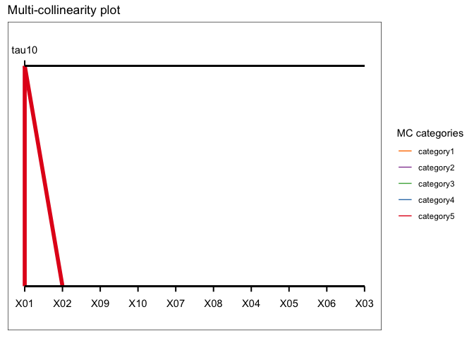

# mcvis: visualisation of multicollinearity in data


[](https://codecov.io/gh/kevinwang09/mcvis?branch=master)


## Introduction

`mcvis` is a R package for visualising multicollinearity in a data
design matrix. The underlying methodology uses resampling techniques to
identify groups of variables that causes multicollinearity.

You can learn more about `mcvis` from [this
vignette](https://kevinwang09.github.io/mcvis/articles/mcvis.html).

## Installation

`mcvis` can be installed using the `devtools` package.

``` r
devtools::install_github("kevinwang09/mcvis")
```

## A quick example

Using a `mcvis` bipartite plot, variables (bottom row) that cause strong
collinearity are visualised as bolded lines connecting with our “tau”
statistics (top row).

``` r
library(mcvis)
library(ggplot2)

set.seed(1)
p = 10
n = 100

X = matrix(rnorm(n*p), ncol = p)
## Inducing collinearity into the design matrix
X[,1] = X[,2] + rnorm(n, 0, 0.1) 


mcvis_result = mcvis(X)
plot(mcvis_result)
```

<!-- -->

# Reference

  - *Lin, C., Wang, K. Y. X., & Mueller, S. (2020). mcvis: A new
    framework for collinearity discovery, diagnostic and visualization.
    Journal of Computational and Graphical Statistics, In Press.*
